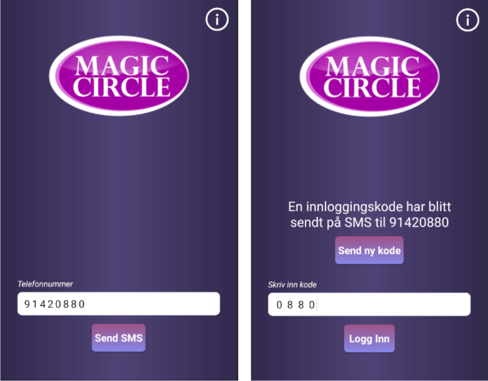
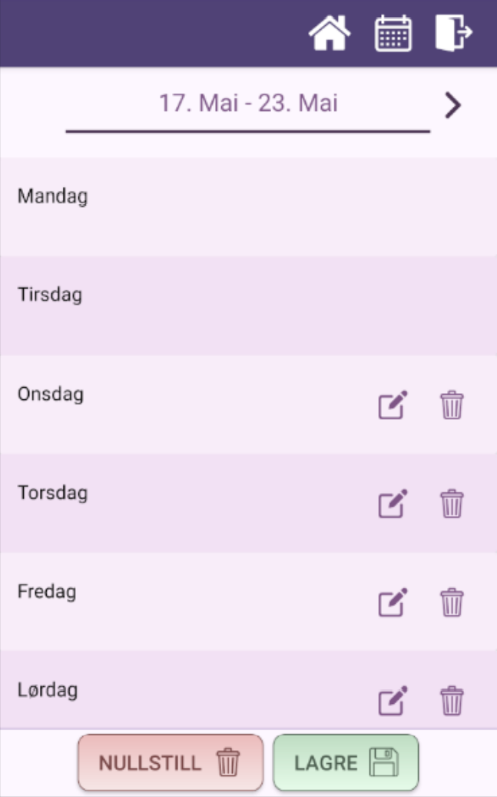
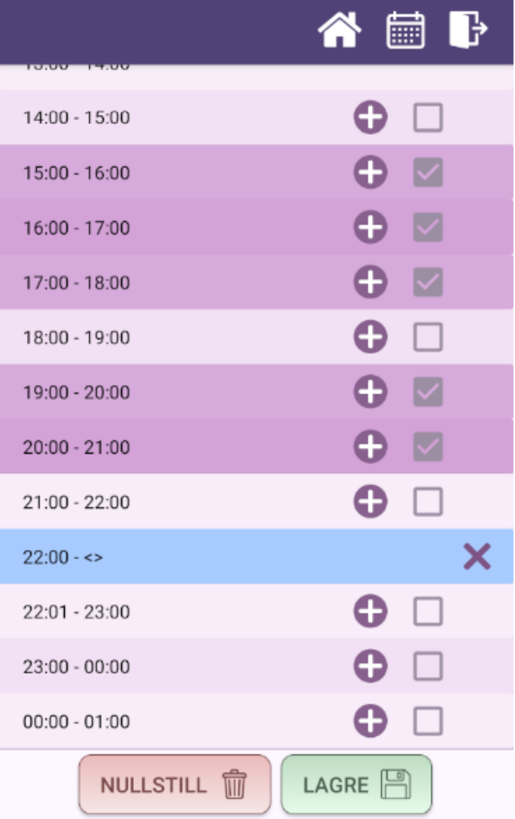

# MolendoAnsattAndroid
This is the Android front end client.

When you first open the app you get sent to a log in page where you enter your phone number and log in code. This uses JSON web tokens so you stay logged in even after you close the app.
 

   

When logged in there is a calendar page where you can register your shifts. You do this by clicking on a day, then selecting when you want your shift to be.
 

 
