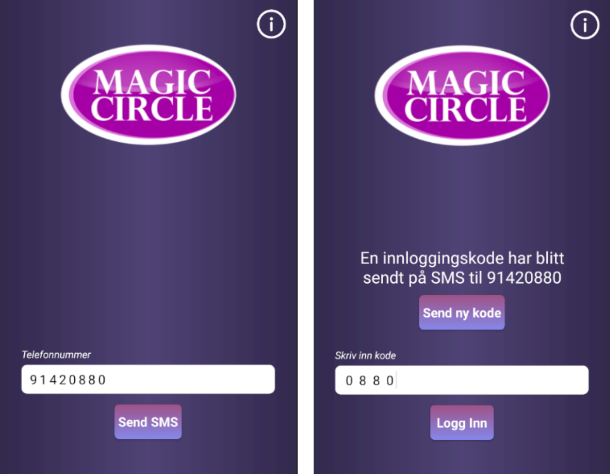

# MolendoAnsattAndroid
This is the Android front end client.

Log in page (Uses JSON web tokens to stay logged in)
 

   

Calendar page for registering shifts. Done by clicking on a day then selecting when your shifts should be
 

   

Page for starting or stopping an ongoing shift with a single button click
 

