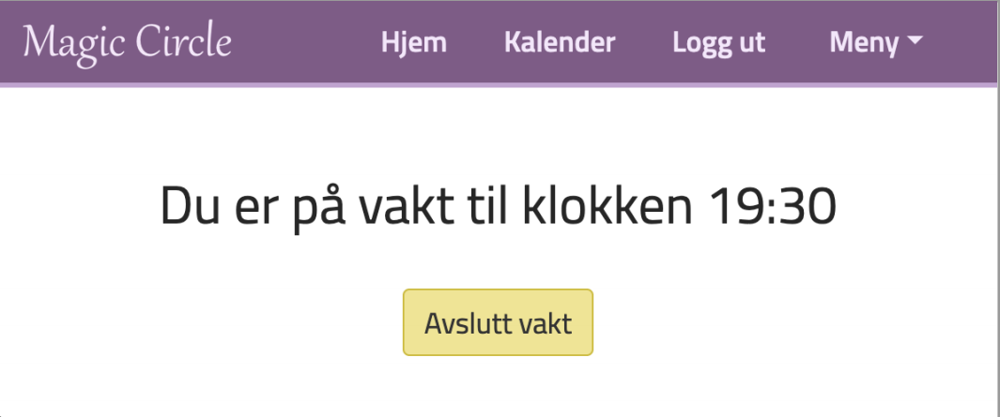

# molendo-ansatt-react
This is a basic overview of the React frontend client

Log in page (Uses JSON web tokens to stay logged in)
 

  
Calendar page for registering shifts
 

  
Page for starting/stopping a shift with a single button click
 

